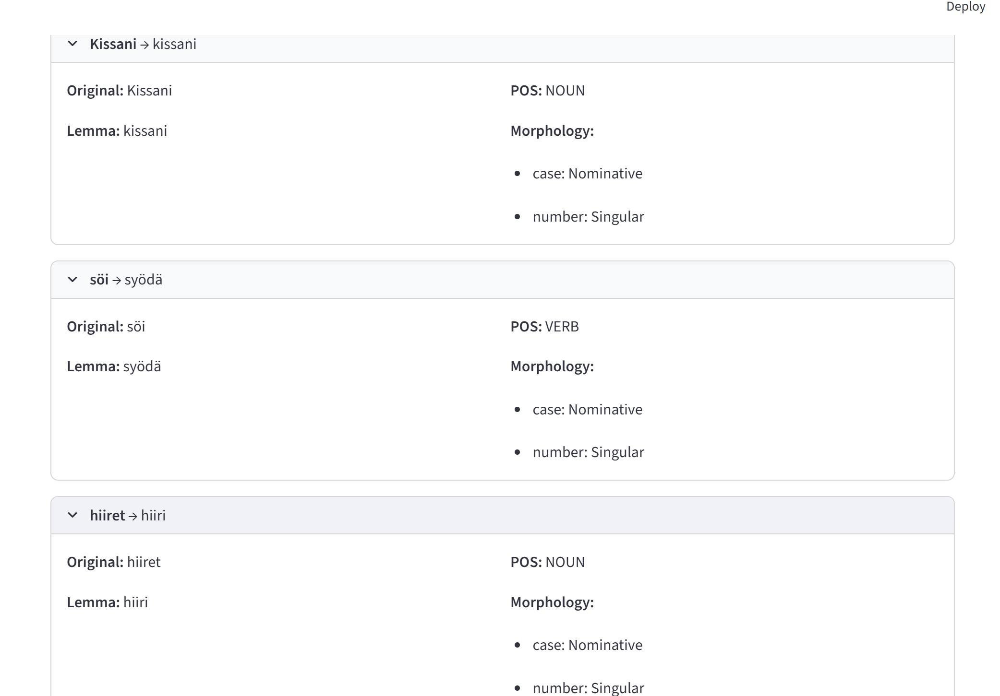
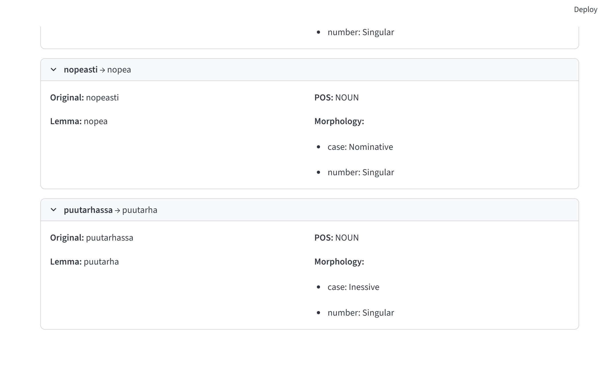
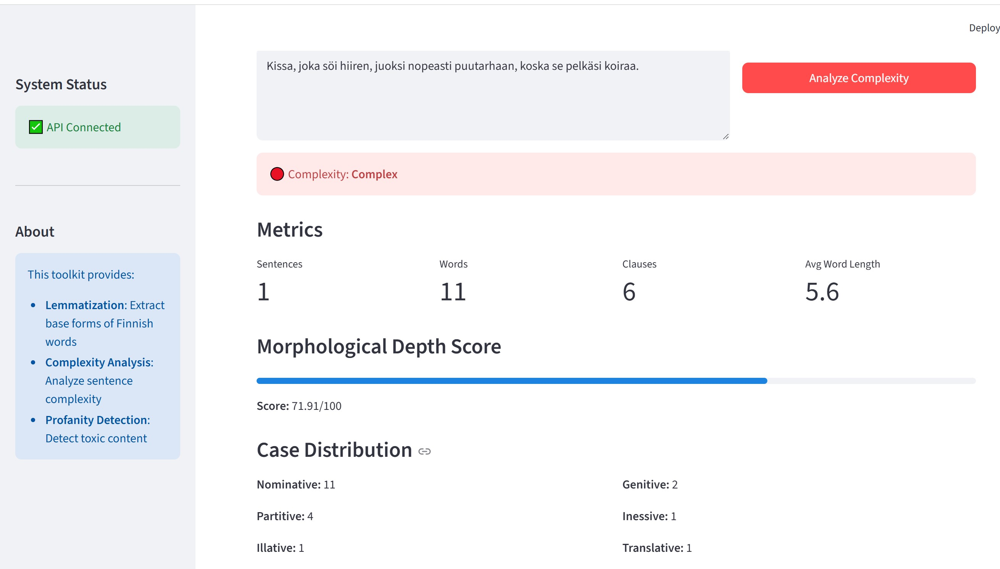
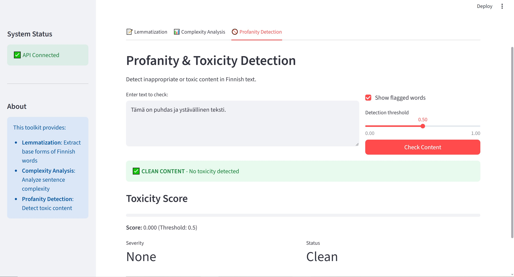
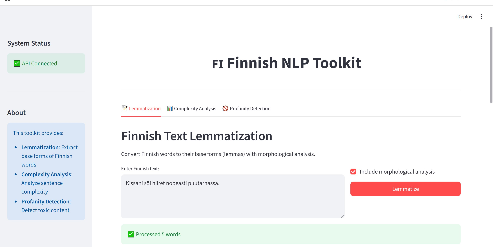

# Finnish NLP Toolkit API

<div align="center">


*A production-ready FastAPI service for Finnish natural language processing*

[Features](#features) • [Quick Start](#quick-start) • [API Docs](#api-endpoints) • [Documentation](#documentation)

</div>

---

## Overview

Finnish NLP Toolkit is a comprehensive backend service providing state-of-the-art Finnish language processing capabilities through a modern REST API and interactive web interface. Built with FastAPI and powered by advanced NLP libraries, it offers lemmatization, complexity analysis, and profanity detection for Finnish text.

### Key Highlights

- ⚡ **High Performance**: Sub-100ms response times for most operations
- 🔄 **Batch Processing**: Process up to 100 texts in a single request
- 🎯 **Dual-Mode Architecture**: Basic (rule-based) and Advanced (ML-powered) engines
- 📊 **Comprehensive Testing**: 66 tests with 100% pass rate
- 🐳 **Docker Ready**: Full containerization with docker-compose
- 📚 **Auto-Generated Docs**: Interactive OpenAPI/Swagger documentation
- 🎨 **Interactive UI**: Streamlit-based frontend for testing

---

## Screenshots

<div align="center">

### API Interface


### Interactive Documentation


### Web UI - Lemmatization


### Advanced Features


### Finnish Language Processing Demo


</div>

---

## Features

### Core NLP Services

#### Lemmatization
Convert Finnish words to their dictionary forms with detailed morphological analysis.

- **Basic Engine**: Rule-based Finnish morphology (works out-of-the-box)
- **Advanced Engine**: Voikko integration for production-grade accuracy
- **Output**: Base form, part-of-speech, case, number, person, tense, mood

#### Complexity Analysis
Analyze linguistic complexity of Finnish sentences and texts.

- **Basic Engine**: Heuristic-based clause detection and metrics
- **Advanced Engine**: UDPipe dependency parsing + spaCy pipeline
- **Metrics**: Clause count, morphological depth, average word length, case distribution

#### Profanity Detection
Detect and filter toxic content in Finnish text.

- **Basic Engine**: Keyword-based filtering (30+ Finnish swear words)
- **Advanced Engine**: FinBERT ML classification (ready for custom models)
- **Features**: Toxicity scoring, severity levels, flagged word identification

### Additional Capabilities

- **Batch Processing**: Process multiple texts efficiently with aggregate statistics
- **Smart Caching**: Redis-backed caching with in-memory LRU fallback
- **Graceful Degradation**: Automatic fallback to basic engines if advanced features unavailable
- **Configuration Management**: Feature flags via environment variables
- **Comprehensive Logging**: Structured logging for monitoring and debugging

---

## Quick Start

### Prerequisites

- Python 3.9 or higher
- pip (Python package manager)
- Docker and Docker Compose (optional, for containerized deployment)

### Installation

#### Option 1: Local Development

```bash
# Clone the repository
git clone https://github.com/Aliipou/finnish-nlp-toolkit-api
cd finapi

# Install dependencies
pip install -r requirements.txt

# Start the API server
uvicorn app.main:app --reload --port 8000

# In another terminal, start the frontend
streamlit run frontend/app.py
```

#### Option 2: Docker Deployment

```bash
# Start all services
docker-compose up -d

# View logs
docker-compose logs -f

# Stop services
docker-compose down
```

### Access Points

| Service | URL | Description |
|---------|-----|-------------|
| REST API | http://localhost:8000 | Main API service |
| API Documentation | http://localhost:8000/docs | Interactive Swagger UI |
| Alternative Docs | http://localhost:8000/redoc | ReDoc documentation |
| Frontend UI | http://localhost:8501 | Streamlit interface |
| Health Check | http://localhost:8000/health | Service status |

---

## API Endpoints

### System Endpoints

| Method | Endpoint | Description |
|--------|----------|-------------|
| GET | `/` | API information and version |
| GET | `/health` | Health check endpoint |
| GET | `/version` | API version details |

### Lemmatization

**Endpoints:**
- `GET /api/lemmatize?text={text}&include_morphology={bool}`
- `POST /api/lemmatize`

**Request:**
```bash
curl "http://localhost:8000/api/lemmatize?text=kissani"
```

**Response:**
```json
{
  "text": "kissani",
  "lemmas": [
    {
      "original": "kissani",
      "lemma": "kissa",
      "pos": "NOUN",
      "morphology": {
        "case": "Nominative",
        "number": "Singular",
        "possessive": "1Sg"
      }
    }
  ],
  "word_count": 1
}
```

### Complexity Analysis

**Endpoints:**
- `GET /api/complexity?text={text}&detailed={bool}`
- `POST /api/complexity`

**Request:**
```bash
curl "http://localhost:8000/api/complexity?text=Kun%20aurinko%20paistoi,%20lapset%20leikkivät&detailed=true"
```

**Response:**
```json
{
  "text": "Kun aurinko paistoi, lapset leikkivät",
  "sentence_count": 1,
  "word_count": 5,
  "clause_count": 2,
  "morphological_depth_score": 45.2,
  "average_word_length": 7.0,
  "complexity_rating": "Moderate",
  "case_distribution": {
    "nominative": 2,
    "genitive": 0,
    "partitive": 0,
    "inessive": 0
  }
}
```

### Profanity Detection

**Endpoints:**
- `GET /api/swear-check?text={text}&return_flagged_words={bool}&threshold={float}`
- `POST /api/swear-check`

**Request:**
```bash
curl "http://localhost:8000/api/swear-check?text=puhdas%20teksti&return_flagged_words=true"
```

**Response:**
```json
{
  "text": "puhdas teksti",
  "is_toxic": false,
  "toxicity_score": 0.0,
  "severity": "None",
  "flagged_words": null
}
```

### Batch Processing

Process multiple texts in a single request for improved efficiency.

**Endpoints:**
- `POST /api/batch/lemmatize`
- `POST /api/batch/complexity`
- `POST /api/batch/swear-check`

**Request:**
```bash
curl -X POST http://localhost:8000/api/batch/lemmatize \
  -H "Content-Type: application/json" \
  -d '{
    "texts": ["kissa", "koira", "lintu"],
    "include_morphology": true
  }'
```

**Response:**
```json
{
  "results": [
    {
      "text": "kissa",
      "lemmas": [...],
      "word_count": 1
    },
    {
      "text": "koira",
      "lemmas": [...],
      "word_count": 1
    },
    {
      "text": "lintu",
      "lemmas": [...],
      "word_count": 1
    }
  ],
  "total_texts": 3,
  "total_words": 3,
  "average_words_per_text": 1.0
}
```

---

## Project Structure

```
finapi/
├── app/                          # Main application package
│   ├── main.py                   # FastAPI application entry point
│   ├── config.py                 # Configuration management
│   │
│   ├── routers/                  # API endpoint definitions
│   │   ├── lemmatizer.py         # Lemmatization endpoints
│   │   ├── complexity.py         # Complexity analysis endpoints
│   │   ├── profanity.py          # Profanity detection endpoints
│   │   └── batch_processing.py   # Batch processing endpoints
│   │
│   ├── services/                 # Business logic and NLP engines
│   │   ├── lemma_engine.py       # Basic lemmatizer
│   │   ├── complexity_engine.py  # Basic complexity analyzer
│   │   ├── profanity_model.py    # Basic profanity detector
│   │   ├── advanced_lemma_engine.py      # Voikko-powered lemmatizer
│   │   ├── advanced_complexity_engine.py # UDPipe + spaCy analyzer
│   │   └── advanced_profanity_model.py   # ML-based detector
│   │
│   ├── models/                   # Data models and schemas
│   │   └── schemas.py            # Pydantic request/response models
│   │
│   ├── utils/                    # Utility modules
│   │   └── cache.py              # Caching layer (Redis + LRU)
│   │
│   └── tests/                    # Test suite
│       ├── test_lemmatizer.py    # Lemmatizer tests (10 tests)
│       ├── test_complexity.py    # Complexity tests (15 tests)
│       ├── test_profanity.py     # Profanity tests (16 tests)
│       └── test_api_integration.py  # Integration tests (25 tests)
│
├── data/                         # Data directory
│   ├── models/                   # NLP models (download required)
│   ├── corpus/                   # Text corpora for training/testing
│   ├── datasets/                 # Training datasets
│   ├── cache/                    # Runtime cache storage
│   └── scripts/
│       └── download_models.py    # Model download automation
│
├── frontend/                     # Web interface
│   ├── app.py                    # Streamlit application
│   └── Dockerfile                # Frontend container
│
├── docs/                         # Documentation
│   ├── API_REFERENCE.md          # Complete API reference
│   └── DEPLOYMENT.md             # Deployment guide
│
├── Dockerfile                    # API container definition
├── docker-compose.yml            # Multi-service orchestration
├── requirements.txt              # Python dependencies
├── requirements-advanced.txt     # Advanced NLP dependencies
├── pytest.ini                    # Test configuration
├── .env.example                  # Environment variables template
└── .gitignore                    # Git ignore rules
```

---

## Configuration

### Environment Variables

Create a `.env` file based on `.env.example`:

```env
# API Configuration
API_HOST=0.0.0.0
API_PORT=8000
API_RELOAD=False
LOG_LEVEL=INFO

# Advanced NLP Features (optional)
USE_VOIKKO=false        # Requires system libvoikko installation
USE_UDPIPE=false        # Requires model download
USE_SPACY=false         # Requires spaCy model
USE_TRANSFORMERS=false  # Requires FinBERT model
USE_REDIS=false         # Requires Redis server

# Model Paths
UDPIPE_MODEL_PATH=data/models/finnish-tdt-ud-2.5-191206.udpipe
TOXICITY_MODEL_PATH=data/models/finnish-toxicity-bert

# Redis Configuration
REDIS_URL=redis://localhost:6379/0
CACHE_TTL=3600

# CORS Settings
CORS_ORIGINS=*
```

### Feature Flags

The application supports graceful degradation through feature flags:

| Flag | Default | Requires | Description |
|------|---------|----------|-------------|
| `USE_VOIKKO` | false | libvoikko | Real Finnish morphological analysis |
| `USE_UDPIPE` | false | Model file | Dependency parsing |
| `USE_SPACY` | false | spaCy model | Modern NLP pipeline |
| `USE_TRANSFORMERS` | false | BERT model | ML-based toxicity detection |
| `USE_REDIS` | false | Redis server | Distributed caching |

When advanced features are unavailable, the system automatically falls back to basic implementations.

---

## Advanced Setup

### Downloading Models

Run the automated download script:

```bash
python data/scripts/download_models.py
```

This will download:
- **UDPipe Finnish Model** (~21MB) - Dependency parsing
- **spaCy Finnish Model** - Modern NLP pipeline
- **Sample Corpus** - Finnish text examples

### Enabling Advanced Features

After downloading models, update `.env`:

```env
USE_UDPIPE=true
USE_SPACY=true
```

### Redis Caching (Optional)

For production deployments with multiple instances:

```bash
# Install and start Redis
docker run -d -p 6379:6379 redis:alpine

# Enable in .env
USE_REDIS=true
REDIS_URL=redis://localhost:6379/0
```

---

## Testing

### Running Tests

```bash
# Run all tests
pytest app/tests/ -v

# Run specific test file
pytest app/tests/test_lemmatizer.py -v

# Run with coverage
pytest app/tests/ --cov=app --cov-report=html

# View coverage report
open htmlcov/index.html
```

### Test Results

```
✓ 66 tests passing (100% pass rate)
├── Lemmatizer: 10 tests
├── Complexity: 15 tests
├── Profanity: 16 tests
└── Integration: 25 tests

Execution time: ~2.6s
```

---

## Performance

| Operation | Basic Engine | Advanced Engine | With Cache |
|-----------|-------------|-----------------|------------|
| Lemmatization | ~50ms | ~100ms (Voikko) | ~5ms |
| Complexity | ~30ms | ~150ms (UDPipe) | ~5ms |
| Profanity | ~20ms | ~300ms (FinBERT) | ~5ms |
| Batch (10 texts) | ~200ms | ~1s | ~50ms |

*Benchmarks on 2.5GHz processor, average over 100 requests*

---

## Documentation

| Document | Description |
|----------|-------------|
| [API Reference](docs/API_REFERENCE.md) | Complete endpoint documentation with examples |
| [Deployment Guide](docs/DEPLOYMENT.md) | Production deployment on Railway, Render, Heroku |
| [Interactive Docs](http://localhost:8000/docs) | Swagger UI (when server running) |
| [ReDoc](http://localhost:8000/redoc) | Alternative API documentation |

---

## Technology Stack

### Backend
- **[FastAPI](https://fastapi.tiangolo.com/)** - Modern async web framework
- **[Pydantic](https://pydantic-docs.helpmanual.io/)** - Data validation using Python type annotations
- **[Uvicorn](https://www.uvicorn.org/)** - Lightning-fast ASGI server

### NLP Libraries
- **[Voikko](https://voikko.puimula.org/)** - Finnish morphological analyzer
- **[UDPipe](https://ufal.mff.cuni.cz/udpipe)** - Universal Dependencies parsing
- **[spaCy](https://spacy.io/)** - Industrial-strength NLP
- **[Transformers](https://huggingface.co/transformers/)** - State-of-the-art ML models

### Infrastructure
- **[Docker](https://www.docker.com/)** - Containerization
- **[Redis](https://redis.io/)** - In-memory caching (optional)
- **[Pytest](https://pytest.org/)** - Testing framework
- **[Streamlit](https://streamlit.io/)** - Interactive web UI

---

## Deployment

### Docker Deployment

```bash
# Build and start services
docker-compose up -d

# View logs
docker-compose logs -f api

# Scale API service
docker-compose up -d --scale api=3

# Stop services
docker-compose down
```

### Cloud Platforms

#### Railway

```bash
# Install Railway CLI
npm install -g @railway/cli

# Deploy
railway login
railway init
railway up
```

#### Render

1. Connect your GitHub repository
2. Select "Docker" as environment
3. Deploy automatically from `Dockerfile`

#### Heroku

```bash
# Login to Heroku
heroku login
heroku container:login

# Create app and deploy
heroku create finnish-nlp-api
heroku container:push web
heroku container:release web
```

See [DEPLOYMENT.md](docs/DEPLOYMENT.md) for detailed instructions.

---

## Contributing

We welcome contributions! Please see our contributing guidelines:

1. Fork the repository
2. Create a feature branch (`git checkout -b feature/amazing-feature`)
3. Make your changes
4. Add tests for new functionality
5. Ensure all tests pass (`pytest app/tests/`)
6. Commit your changes (`git commit -m 'Add amazing feature'`)
7. Push to the branch (`git push origin feature/amazing-feature`)
8. Open a Pull Request

---

## License

This project is licensed under the MIT License - see the [LICENSE](LICENSE) file for details.

---

## Acknowledgments

- **[Turku Dependency Treebank](https://universaldependencies.org/treebanks/fi_tdt/index.html)** - Finnish linguistic resources
- **[Universal Dependencies](https://universaldependencies.org/)** - Treebank annotation standards
- **[Voikko Project](https://voikko.puimula.org/)** - Open-source Finnish language tools
- **[TurkuNLP](https://turkunlp.org/)** - Finnish NLP research group

---

<div align="center">

**[⬆ back to top](#finnish-nlp-toolkit-api)**

Made with ❤️ for the Finnish NLP community

</div>
